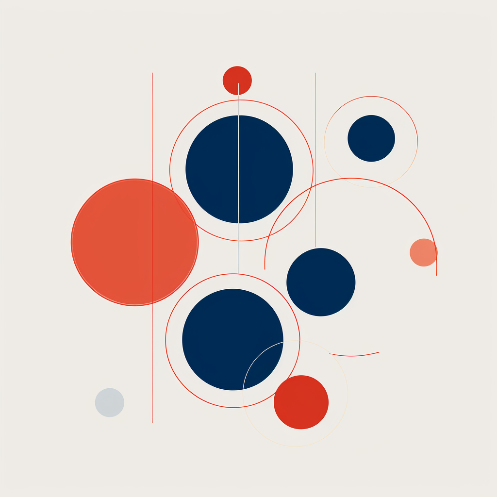

# Grammars 📄

</img>

[![Contributors][contributors-badge]][contributors]
[![Discord][discord-badge]][discord]
[![Twitter][twitter-badge]][twitter]

*Context-free grammars you can use with Outlines*

[Contribute new functions](https://github.com/outlines-dev/functions/pulls)  •
[Share your ideas][discord]

[contributors]: https://github.com/outlines-dev/grammars/graphs/contributors
[contributors-badge]: https://img.shields.io/github/contributors/outlines-dev/functions?style=flat-square&logo=github&logoColor=white&color=ECEFF4
[twitter]: https://twitter.com/dottxtai
[twitter-badge]: https://img.shields.io/twitter/follow/dottxtai?style=social
[discord]: https://discord.gg/R9DSu34mGd
[discord-badge]: https://img.shields.io/discord/1182316225284554793?color=81A1C1&logo=discord&logoColor=white&style=flat-square
